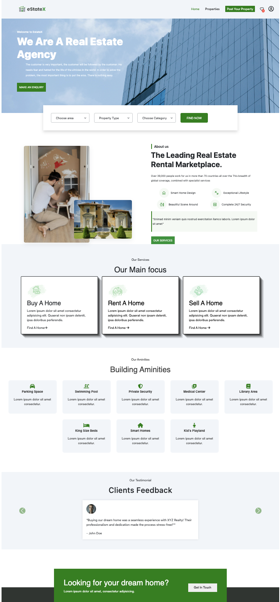
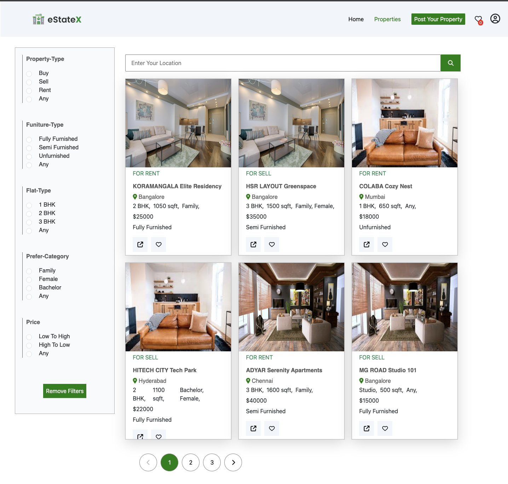
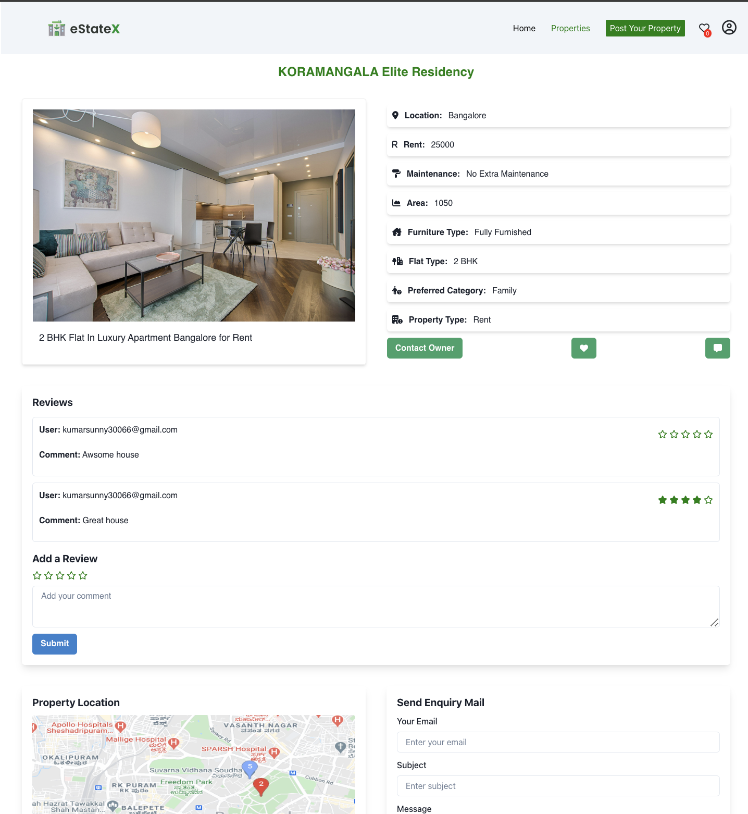
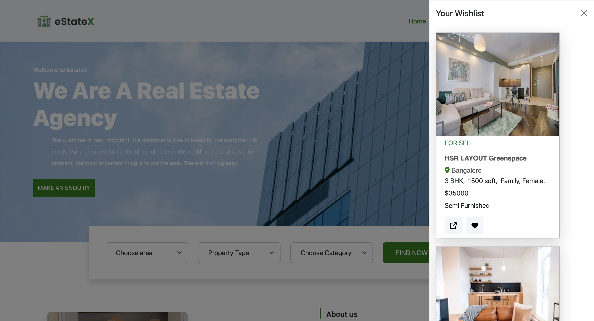

# Tencent-Titans_033

### estate X

Estate X offers a curated selection of limited-time deals on a variety of real estate properties. Explore the latest listings, spanning categories such as residential homes, commercial spaces, vacation properties, and more. With a focus on time-sensitive opportunities, Estate X provides users with exclusive property deals and discounts available for a short period, creating a sense of urgency in their search for the perfect property.

### To view admin Dash-board
-username:admin@gmail.com
-password:admin12345

### Project Type

Frontend | Backend

### Deployed Link

-[Live Demo ](https://estate-x.netlify.app/)

### Directory Structure

Tencent-Titans_033/
├─ backend/  
│ ├─ server.js  
│ ├─ routes/  
│
├─ ...Rest

### Video Walkthrough of the project

-[Presentation Link](https://youtu.be/vRymSOUnxGU)

### Questionnaires related to project

-[Video 1](https://youtu.be/jdvzZ7Jyvmc) -[Video 2](https://youtu.be/nYPSRGKbNsg)

### Screenshots

**Landing Page**



**Properties Page**



**Property Detail Page**



**Whislist Page**



**Mobile view**


### Features

- **Login and Signup**: "Effortlessly access exclusive deals by logging in or sign up for personalized shopping experiences.
- **Whislist**: Keep track of your favorite deals properties.
- **Search bar**: Easily find the deals you love with our intuitive search bar.
- **Property Details Page**:Explore comprehensive information and make informed decisions on our product details page.
- **carousel**:Discover a dynamic showcase of featured deals with our engaging carousel.

### Tech Stack

- **HTML**: Provides the structure and content for the web page.
- **CSS**: Handles the UI and styling, ensuring an appealing visual presentation.
- **React**:Facilitates building interactive and dynamic user interfaces through reusable components and efficient state management.

- **Bootstrap**:Offers a responsive and mobile-first framework, simplifying the design and layout of web pages with pre-built components and styles.
- **Chakra**:A UI library that provides accessible, themeable, and reusable components for building modern web applications with ease.
- **Re-Chart**:Enables the creation of customizable and interactive charts and graphs, making it easier to visualize data effectively in React applications.
- **Typescript**:TypeScript empowers dynamic and interactive web experiences through its versatile scripting capabilities.
- **Json Server**:JSON Server simplifies backend development by allowing you to quickly create a REST API with JSON data, streamlining your development process and enabling rapid prototyping.

### Design Elements

- **Interactive**: Card will increase in sized in a smooth way when curser hover them also the button changes the colors and in header the dropdown menu comes up and a red underline comes when user interact with it.

- **Carousel**: A responsive slideshow for cycling images or text, with controls and indicators.

- **Flex and Grid**: Many of the elements takes the benefits of display flex and display grid to provide more control over the deferent layout in different sections of website.

- **Fonts & Icons**: Integrates Google Fonts and FontAwesome icons for enhanced typography and visual elements. By leveraging these resources, the website achieves a modern and visually appealing design, improving readability and user engagement.

### How to Use

To run this project locally:

1. Clone this repository to your local machine.

```
git clone https://github.com/Adarsh-ch/Tencent-Titans_033

```

2. Navigate to the project directory.

```
cd Tencent-Titans_033

```

3.Install the dependencies.

```
npm install

```

4. Start the development server.

```
npm run dev

```

5. Start JSON serve

```
npm run start

```

### Contributors

- [Adarsh Chaturvedi](https://github.com/Adarsh-ch)
- [ Venigalla Mohan Krishna](https://github.com/mohankrish1)
- [Disha Paltani](https://github.com/DishaPaltani)
- [ Sunny Kumar](https://github.com/aniyant)

### Acknowledments

- Inspired by our own thoughts.
- Special thanks to our dedicated team for their invaluable contributions to Zepto and our mentor/IA Ritesh Ranjan Sir for giving us directions and material for this project.
